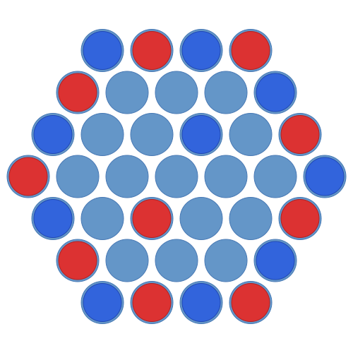
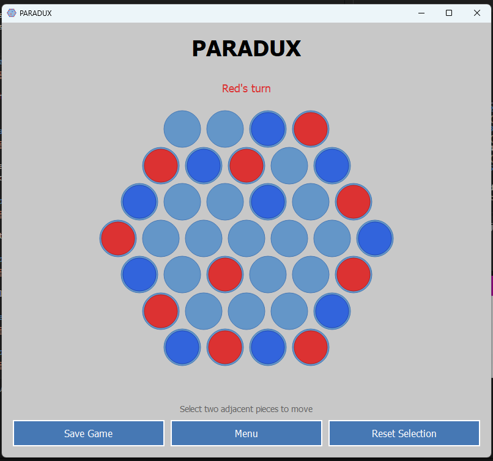
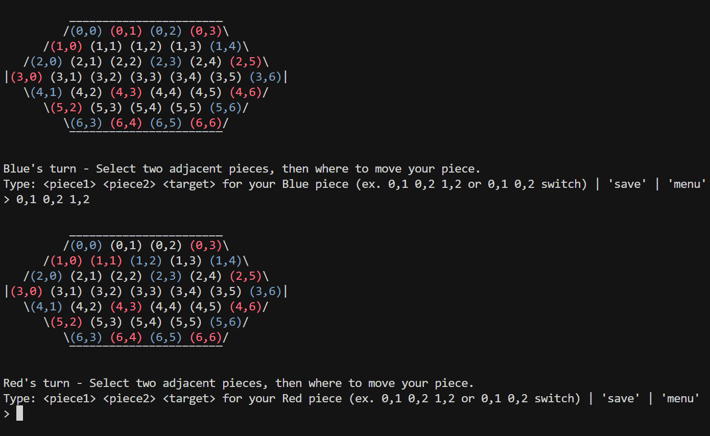

# Paradux

[](https://github.com/haseebn19/paradux/actions/workflows/ci.yml)



A strategic two-player board game where the objective is to align four of your tokens in a row on a hexagonal grid.

## Screenshots





## Features

- **Terminal & GUI Modes**: Play in the console or through a modern PyQt5 window
- **Hexagonal Board Logic**: Complex movement system enforcing adjacency and parallel motion
- **Save & Load System**: Persist your game state seamlessly using JSON files
- **Rule Enforcement**: Strict validation of piece swapping, shifting, and boundary constraints
- **MVP Architecture**: Clear separation between core game state (Model), user interface components (Passive Views), and user input / coordination logic (Presenter)

## Prerequisites

- Python 3.11+
- PyQt5

## Installation

```bash
git clone https://github.com/haseebn19/paradux.git
cd paradux

# Create virtual environment
python -m venv .venv

# Activate virtual environment
# On Windows:
.venv\Scripts\activate
# On macOS/Linux:
source .venv/bin/activate

# Install the package
pip install .
```

## Usage

```bash
# Launch the game (GUI or Terminal depending on system capabilities)
python -m paradux
```

1. Select **New Game** from the main menu
2. Wait for the game to indicate whose turn it is
3. Select two adjacent pieces (one of yours, one opponent's)
4. Choose the target destination to move your pieces in tandem
5. Use the "Switch Pieces" option when blocked by edge cases

## Development

### Setup

```bash
# Create and activate virtual environment
python -m venv .venv
.venv\Scripts\activate  # Windows
source .venv/bin/activate  # macOS/Linux

# Install in editable mode with dev dependencies
pip install -e ".[dev]"
```

### Testing

```bash
pytest
```

With coverage:

```bash
pytest --cov=src/paradux --cov-report=term-missing
```

### Linting

```bash
ruff check .
ruff format --check .
```

## Building

```bash
pip install build
python -m build
```

Output location: `dist/`

## Project Structure

```
paradux/
├── src/
│   └── paradux/
│       ├── assets/              # Bundled resources (logo)
│       ├── __init__.py          # Package definition
│       ├── __main__.py          # Application entry point
│       ├── interfaces.py        # Enums, constants, and GameView protocol
│       ├── model.py             # Game logic, state, and rule validation
│       ├── controller.py        # Input handling and terminal loop
│       ├── gui_view.py          # PyQt5 graphical interface
│       ├── view.py              # Terminal text rendering
│       └── save_load_manager.py # JSON persistence
├── docs/                        # Screenshots
├── tests/                       # Pytest suite
├── .github/workflows/           # CI pipeline
├── pyproject.toml               # Project config
└── LICENSE                      # MIT License
```

## Contributing

1. Fork the repository
2. Create a feature branch (`git checkout -b feature/amazing-feature`)
3. Commit your changes (`git commit -m 'Add amazing feature'`)
4. Push to the branch (`git push origin feature/amazing-feature`)
5. Open a Pull Request

## Credits

### Development Team
- Haseeb Niazi
- Nathan Starkman
- Gail Mathew
- Dana Kleber

### Third-Party Libraries
- [PyQt5](https://pypi.org/project/PyQt5/) - GUI rendering and event loop
- [pytest](https://docs.pytest.org/) - Testing framework
- [ruff](https://docs.astral.sh/ruff/) - Python linting and formatting

## License

This project is licensed under the [MIT License](LICENSE).

---

*Originally developed for CIS\*3260 at the University of Guelph.*